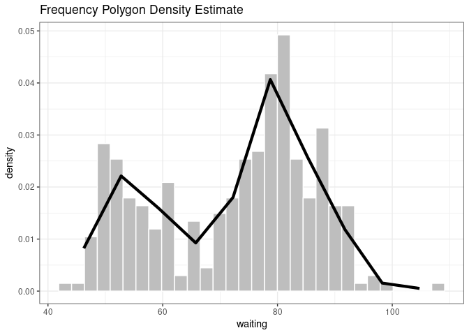

<!-- README.md is generated from README.Rmd. Please edit that file -->

# fpashr R package

### Written by Raphaël Brena, Tom McGrory, Kate Whelan and Conor Foran

<!-- badges: start -->

<!-- badges: end -->

## Description

**fpashr** is an R package that Provides tools for constructing
continuous density estimators based on histogram refinements.

    1. `compute_fp()`: for calculating values needed to construct a frequency polygon from numeric data.

    2. `compute_ash()`: Estimates density by averaging multiple shifted histograms.

    3. `plot.hist_estimate()` method:  An S3 method that plots a histogram of a density estimate obtained from continous             histogram estimators. The estimates may be produced by either a frequency polygon or an average shifted polygon.

    4. `validate_density()`:  Uses numerical integration to verify that the total area under a density estimate is                   approximately equal to 1. 

    Typically, these functions are applied sequentially. A demonstration of the typical workflow of the `fpashr` package follows below.

## Installation

You can install the development version of fpashr from
[GitHub](https://github.com/) with:

``` r
# install.packages("pak")
pak::pak("RaphaelBRENA/fpashr")
```

## Example

This is a basic example which shows you how to compute a frequency
polygon using the geyser dataset

``` r
library(fpashr)
library(MASS)
data(geyser)
fp <- compute_fp(geyser$waiting,bins = 10)
```

A histogram can be created using our S3 method

``` r
plot(fp)
```



The density estimate can be calculated and validated numerically

``` r
validate_density(fp)
#> Density Validation Results
#> ==========================
#> Total area under curve: 0.971572
#> Deviation from 1.0: 0.028428
#> Tolerance: 0.010000
#> Valid density: NO
#> 
#> Warning: Area deviates from 1.0 by more than tolerance (0.010000)
```

A more thorough introduction is provided in the `fpashr` vignette.
